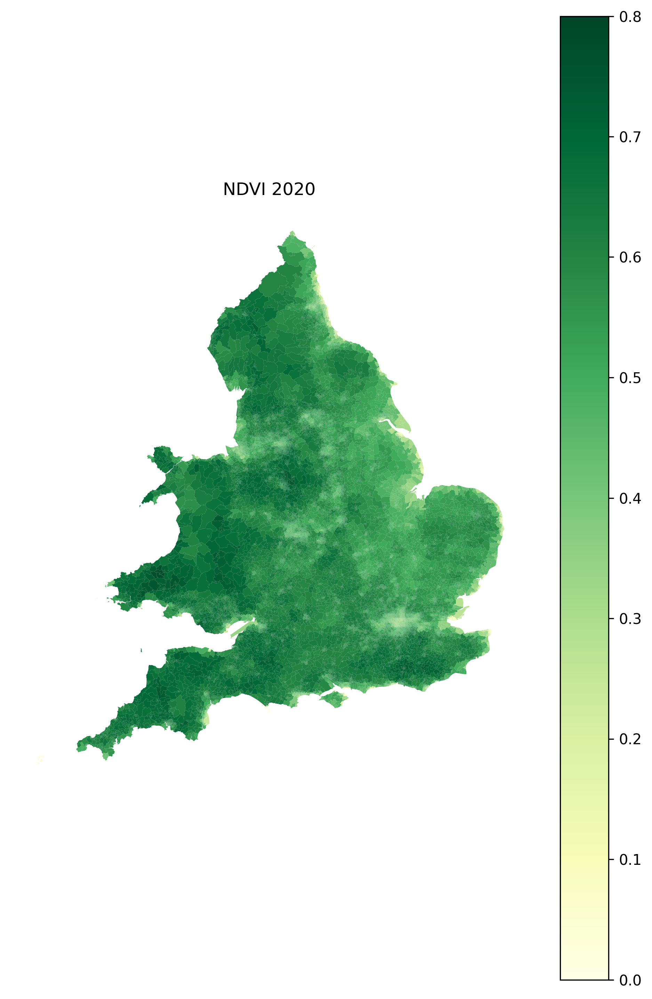

# LSOA 2021 Exposure Data Pipeline

## Overview

This project builds annual environmental and contextual exposure datasets for **English 2021 Lower-layer Super Output Areas (LSOAs)**. It harmonises historic data to the 2021 LSOA geography where necessary, processes DEFRA Pollution Climate Mapping (PCM) grids, and attaches Local Authority District (LAD)-level Adult Smoking Prevalence Survey (APS) estimates to constituent LSOAs.

The principal outputs are:

- Area-weighted LSOA correspondence tables for 2001, 2011, and 2021 geographies.
- Annual population estimates for 2002–2024 on 2021 English LSOA boundaries.
- Annual aggreagated NDVI for 2003–2020 on 2021 English LSOA boundaries (see function/).
- Annual DEFRA PCM pollutant rasters and LSOA-level pollutant exposures.
- Annual LSOA-level ozone exposure estimates.
- LAD-contextual APS smoking-prevalence variables assigned to 2021 LSOAs.

> **Important:** Several inputs are not intrinsically available on 2021 LSOA boundaries. The project uses geographic area weights for historic LSOA counts and assigns smoking values at LAD level. These transformations should be accounted for in downstream interpretation.

<figure style="width: 50%; max-width: 700px; margin: 0;">
  <table role="presentation" style="width: 100%; border-collapse: collapse; table-layout: fixed;">
    <tr>
      <td style="width: 50%; padding: 0 4px 0 0; vertical-align: top;">
        
      </td>
      <td style="width: 50%; padding: 0 0 0 4px; vertical-align: top;">
        
      </td>
    </tr>
  </table>
  <figcaption>
    <strong>Figure:</strong> Annual aggregated NDVI calculated by averaging raster-derived NDVI values within each LSOA: left, 2003; right, 2020.
  </figcaption>
</figure>

## Project structure

A typical project layout is:

```text
project-root/
├── README.md
├── lsoa11221.R
├── bulk_download_website.R
├── pop.R
├── read_defra_pollutants.R
├── air_extract.R
├── ozone.R
├── fingertips.R
├── data/
│   ├── lsoa/
│   ├── lsoa_pop_est_sing/
│   ├── defra/
│   │   ├── benzene/
│   │   ├── pm25/
│   │   ├── pm10/
│   │   ├── nox/
│   │   └── ozone/
│   └── derived/
└── outputs/
```

All scripts should be run from the project root. The workflows use `here::here()` for project-relative paths; initialise an R project or place a `.here` file in the root directory if needed.

## Scripts

### `lsoa11221.R` — LSOA area-weighted crosswalks

Builds England-only correspondence weights between LSOA boundary vintages:

- LSOA 2001 to LSOA 2011;
- LSOA 2011 to LSOA 2021; and
- LSOA 2001 to LSOA 2021, chained through LSOA 2011.

For one-to-many boundary changes, the script calculates the share of the source polygon’s area that intersects each target polygon. One-to-one relationships receive a weight of one. It also normalises weights so that the weights associated with every source LSOA sum to one.

The script creates or exposes objects including:

| Object | Description |
|---|---|
| `poly_lsoa_01` | England-only 2001 LSOA boundaries |
| `poly_lsoa_11` | England-only 2011 LSOA boundaries |
| `poly_lsoa_21` | England-only 2021 LSOA boundaries |
| `lookup_wgt_01_11` | 2001 to 2011 area-weighted crosswalk |
| `lookup_wgt_11_21` | 2011 to 2021 area-weighted crosswalk |
| `lookup_wgt_01_21` | 2001 to 2021 crosswalk via 2011 |

**Methodological note:** Area weights are appropriate for additive values such as counts, under an assumption of uniform within-area distribution. Do not directly use them to transfer rates, percentages, means, medians, or other non-additive measures. Where possible, transfer numerators and denominators separately and recalculate the rate.

### `bulk_download_website.R` — ONS data download helper

Downloads required ONS datasets recursively. Use this script before running workflows that depend on LSOA boundaries, lookup tables, or population-estimate workbooks.

After download, verify that files are extracted beneath the expected `data/` directories and that their filenames match the filenames configured in the scripts. ONS releases can change names, versions, folder structures, and column names.

### `pop.R` — annual LSOA population estimates

Builds a consistent annual population dataset for **2002–2024** on 2021 English LSOA boundaries. Outputs include total population and female/male counts in selected age groups.

- **2002–2010:** reads legacy single-year-of-age estimates on 2011 LSOAs, aggregates them into age bands, and transfers additive counts to 2021 LSOAs using `lookup_wgt_11_21`.
- **2011–2024:** reads LSOA 2021 single-year-of-age workbooks directly and aggregates them into the same age bands.

Expected output:

```text
data/pop_regrouped_2002_2024.csv
```

Key fields include:

- `year`
- `lsoa_2021_code`, `lsoa_2021_name`
- `lad_code`, `lad_name`
- `total`
- `f_25_49`, `f_50_74`, `f_75_plus`
- `m_25_49`, `m_50_74`, `m_75_plus`

### `read_defra_pollutants.R` — DEFRA PCM CSV to raster conversion

Converts annual DEFRA PCM pollutant CSV grids into British National Grid GeoTIFFs. It also crops annual rasters to their shared spatial overlap, so values can be compared cell by cell across years.

The script is intended to be run once for each pollutant, for example:

- `benzene`
- `pm25`
- `pm10`
- `nox`

Expected outputs for each pollutant:

```text
data/defra/<pollutant>/geotiff/<pollutant>_<year>.tif
data/defra/<pollutant>/geotiff_overlap/<pollutant>_<year>_overlap.tif
data/defra/<pollutant>/plots/
```

Before running, confirm the input PCM CSV format: metadata-row count, coordinate fields, metric column, coordinate reference system, resolution, and missing-value convention.

### `air_extract.R` — non-ozone air-pollution exposure extraction

Extracts area-weighted mean values from annual DEFRA PCM overlap rasters to 2021 English LSOA polygons and saves the enriched spatial layer as a GeoPackage.

It expects rasters named as follows:

```text
data/defra/<pollutant>/geotiff_overlap/<pollutant>_<year>_overlap.tif
```

The output contains fields such as `benzene2003`, `pm252010`, and `nox2024`.

Expected output:

```text
air_lsoa_eng.gpkg
```

### `ozone.R` — parallel annual ozone exposure extraction

Reads annual DEFRA PCM ozone CSV grids and extracts LSOA-level mean ozone exposure. Years are processed with `future` multisession workers, which is generally safer than multicore processing for `sf`, GDAL, GEOS, and `terra` workflows.

For each year, the script writes:

```text
outputs/ozone_lsoa_yearly/ozone_lsoa_eng_<year>.gpkg
outputs/ozone_lsoa_yearly/png/ozone_lsoa_eng_<year>.png
outputs/ozone_lsoa_yearly/rds/ozone_lsoa_eng_<year>.rds
```

It uses sequential fallbacks when an LSOA has no valid exact extraction:

1. exact cell-coverage-weighted polygon mean;
2. ordinary polygon mean; then
3. value at a representative point within the LSOA.

Check the extraction summary before analysis. Values obtained through a point fallback are not area-weighted estimates.

### `fingertips.R` — APS smoking prevalence exposure

Downloads **Adult Smoking Prevalence Survey (APS)** estimates from the OHID Fingertips API at LAD level and assigns each LAD estimate to the LSOA 2021 areas within it.

Expected outputs:

```text
data/derived/lsoa2021_smoking_aps_long.csv
data/derived/lsoa2021_smoking_aps_wide.csv
```

> **Important limitation:** APS smoking prevalence is not estimated at LSOA level in this workflow. All LSOAs within a LAD receive the same LAD-level value. Treat it as a LAD-contextual exposure variable, rather than a measured or modelled small-area smoking-prevalence estimate.

The workflow includes explicit pragmatic handling for some unavailable values, including successor LADs in Northamptonshire and small authorities. Review and report these rules when using the data.

## Required input data

### LSOA boundaries and lookup tables

Place boundary shapefiles and lookup CSV files beneath `data/lsoa/`.

Recommended sources:

- [LSOA 2001 to LSOA 2011 to LAD 2011 lookup](https://www.data.gov.uk/dataset/4048a518-3eaf-457a-905c-9e04f4fffca8/lower-layer-super-output-area-2001-to-lower-layer-super-output-area-2011-to-local-authority-district-2011-lookup-in-england-and-wales)
- [LSOA 2011 to LSOA 2021 to LAD 2022 exact-fit lookup](https://www.data.gov.uk/dataset/03a52a27-36e7-4f33-a632-83282faea36f/lsoa-2011-to-lsoa-2021-to-local-authority-district-2022-exact-fit-lookup-for-ew-v3)
- [LSOA 2001 boundaries](https://geoportal.statistics.gov.uk/datasets/lower-layer-super-output-areas-december-2001-boundaries-ew-bfe/about)
- [LSOA 2011 boundaries](https://geoportal.statistics.gov.uk/datasets/ons::lower-layer-super-output-areas-december-2011-boundaries-ew-bfc-v3/about)
- [2011 census geography alternative](https://data.london.gov.uk/dataset/2011-census-geography-boundary-files-29jwj/)

### ONS population estimates

Download ONS small-area population-estimate workbooks and place them in:

```text
data/lsoa_pop_est_sing/
```

The population workflow uses legacy `.xls` single-year-of-age files for 2002–2010 and `sapelsoasyoa*.xlsx` files for 2011 onward.

### DEFRA PCM data

Download annual PCM CSV grids from:

- [DEFRA UK-AIR PCM data](https://uk-air.defra.gov.uk/data/pcm-data)

Place them beneath `data/defra/` in pollutant-specific folders. The ozone script expects ozone files in:

```text
data/defra/ozone/
```

### OHID Fingertips API

No manual download is ordinarily required for `fingertips.R`; it retrieves data using the `fingertipsR` package. The relevant source is:

- [OHID Fingertips](https://fingertips.phe.org.uk/)

## Recommended execution order

1. Run `download_ons.R`, or manually download and extract all ONS inputs.
2. Run `lsoa11221.R` to build geographic objects and area-weighted crosswalks.
3. Run `pop.R` to generate population estimates on 2021 LSOA boundaries.
4. For each DEFRA pollutant, configure and run `read_defra_pollutants.R` to create aligned GeoTIFFs.
5. Run `air_extract.R` to extract non-ozone pollutant values to LSOAs.
6. Run `ozone.R` to process annual ozone exposure data.
7. Run `fingertips.R` to create LSOA-linked APS smoking exposure files.

## R dependencies

Package requirements vary by script. Common dependencies include:

```r
install.packages(c(
  "sf", "terra", "here", "dplyr", "data.table", "readr",
  "readxl", "tidyr", "purrr", "stringr", "tibble", "future",
  "parallelly", "ggplot2", "fingertipsR"
))
```

Some spatial installations may also require system libraries for GDAL, GEOS, PROJ, and UDUNITS.

## Quality assurance checklist

Before analysis, verify that:

- All expected source files were found and read successfully.
- LSOA crosswalk weights sum to one within each source LSOA, allowing for small floating-point tolerances.
- There are no duplicate LSOA-year population records.
- The population total and age-band values are plausible and consistently defined across source releases.
- DEFRA rasters have the expected CRS, grid resolution, extent, year, pollutant metric, and units.
- All required pollutant-year raster files exist before LSOA extraction.
- Ozone extraction summaries show acceptable missingness and identify point-fallback values if applicable.
- APS smoking outputs have the expected number of English LSOAs and no unreviewed missing values.
- Metadata, source-release dates, and any imputation rules are recorded alongside analytical outputs.

## Citation and use

Cite and comply with the terms of the original data providers: ONS, DEFRA/UK-AIR, and OHID. These scripts create derived datasets; they do not replace the source documentation or source-specific quality guidance.

If you use this repository, please cite:
Suen, M. H. (2026). *LSOA 2021 Exposure Data Pipeline: Harmonised Environmental and Contextual Exposure Data for English 2021 Lower-layer Super Output Areas* (Version 1.0) [Computer software]. GitHub. https://github.com/enoch26/cd3

### BibTeX

```bibtex
@misc{suen2026lsoa,
author = {Suen, Man Ho},
title = {LSOA 2021 Exposure Data Pipeline: Harmonised Environmental and Contextual Exposure Data for English 2021 Lower-layer Super Output Areas},
year = {2026},
version = {1.0},
url = {https://github.com/enoch26/cd3},
note = {R scripts and workflows for generating annual environmental and contextual exposure datasets on 2021 English LSOA boundaries, including population estimates, NDVI, air pollution, ozone, and smoking prevalence indicators}
}
```